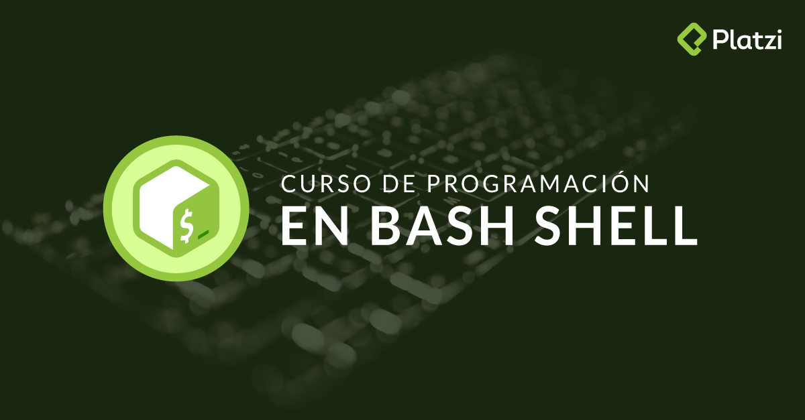

# Programación en Bash Shell

     

## Descripción

Este repositorio me sirve para practicar la programación en Bash Shell. He abierto un nuevo apartado en docs/ para poder documentar cada proceso de programación y apuntes para nuevos proyectos que utilize esta plataforma.



## Tabla de Contenido

- [Programación en Bash Shell](#programaci%c3%b3n-en-bash-shell)
  - [Descripción](#descripci%c3%b3n)
  - [Tabla de Contenido](#tabla-de-contenido)
  - [Requisitos de sistema](#requisitos-de-sistema)
  - [Test](#test)
    - [Screenshots](#screenshots)
  - [Autores](#autores)
  - [Contribuciones](#contribuciones)
  - [Código de Conducta](#c%c3%b3digo-de-conducta)
  - [Licencia](#licencia)
    - [Limitación de Responsabilidades](#limitaci%c3%b3n-de-responsabilidades)
  - [Versiones](#versiones)

## Requisitos de sistema

| Sistema Operativo | Console            | Versión                            |  Espacio Disco | Soportado |
| ----------------- | ------------------ | ---------------------------------- | -------------- | --------- |
| Linux             | Terminal           | +                                  | 2GB            | si        |
| MAC OSX           | Terminal           | +                                  | 2GB            | si        |
| Windows           | PowerShell         | Windows XP+                        | 1GB            | si        |

## Test

Para poder ejecutar cada uno de los scripts tienes que descargar el directorio a tu ordenador local.

Una vez descargado ejecutaremos la linea de comandos en el directorio resources/ con permisos de administrador.

para poder ejecutar un archivo realizaremos el siguiente comando.

```bash
./archivo.sh
```

### Screenshots

## Autores

**[Adrià Rigall](https://www.github.com/Rigui73)** - Autor Principal

## Contribuciones

Lea [CONTRIBUTING.md](/.github/CONTRIBUTING.md) para obtener detalles sobre nuestro proceso para enviarnos solicitudes de extracción.

## Código de Conducta

Lea [CODE_OF_CONDUCT.md](/.github/CODE_OF_CONDUCT.md) para obtener detalles sobre nuestro código de conducta.

## Licencia

Este proyecto está licenciado bajo la licencia MIT, Consulte el archivo [LICENSE](/LICENSE) para obtener más información.

### Limitación de Responsabilidades

No nos hacemos responsables, bajo circunstancia alguna, de daño ni indemnización, moral o patrimonial; directo o indirecto; accesorio o especial; o por vía de consecuencia, previsto o imprevisto, que pudiese surgir:

**i**. Bajo cualquier teoría de responsabilidad, ya sea por contrato, infracción de derechos de propiedad intelectual, negligencia o bajo cualquier otra teoría; y/o

**ii**. A raíz del uso de la Herramienta Digital, incluyendo, pero sin limitación de potenciales defectos en la Herramienta Digital, o la pérdida o inexactitud de los datos de cualquier tipo. Lo anterior incluye los gastos o daños asociados a fallas de comunicación y/o fallas de funcionamiento de computadoras, vinculados con la utilización de la Herramienta DigiPtal.

## Versiones

Vea todos los cambios realizados en el proyecto en el archivo [CHANGELOG.md](/CHANGELOG.md).
